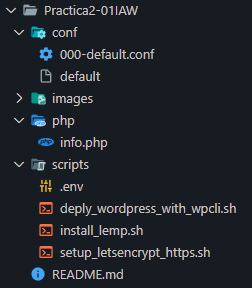

# Practica2-01IAW
En este repositorio es para la práctica 2 apartado 1 de IAW:

- Nuestro profesor nos ha pedido que nos centremos principalmente en el apartado ["1.3. Configuración de Nginx para comunicarse con php-fpm a través de un socket UNIX"](https://josejuansanchez.org/iaw/practica-02-01-teoria/index.html#configuración-de-nginx-para-comunicarse-con-php-fpm-a-través-de-un-socket-unix) que es instalar la *_Pila_LEMP_* en nuestrá maquina de *_AWS_*


# Orden de los directorios

- En este apartado a pesar de que nos centramos en instalar el apartado 1.3, añadiremos también los otros scripts posibles que nos pide la práctica.

    El orden que tendremos que tener será el siguiente, asi mismo añado el archivo de `php.info` como hemos realizado en prácticas anteriores. Al cual podemos acceder a través de la *_URL_* de nuestra ip flotante `[IPFLOTANTE]/info.php`

    


# Script de instalación *_LEMP_*

- Tenemos que crear un *_script_* para la correcta instalación de la pila `lemp`

    ```
    #!/bin/bash

    #Script para la instalación de la pila LEMP
    
    #Esto muestra todos los comandos que se van ejecutando

    set -x 

    #Actualizamos los repositorios

    apt update

    #Actualizamos los paquetes de la máquina 

    #apt upgrade -y

    #Instalamos el servidor web (NGINX):

    apt install nginx -y 

    #Instalamos las librerias que nos pide la práctica que son php-fmp y php-mysql 

    apt install php-fpm php-mysql -y

    #<-----------------------------------Archivo de configuración-------------------------------------------------------->

    #Copiamos el archivo de configuración llamado (Default).

    cp ../conf/default /etc/nginx/sites-available/default

    #<-----------------------------------Fin de Archivo de configuración-------------------------------------------------------->


    #Reiniciamos el servicio de Ngix (Como apache2 pero diferente comando).

    systemctl restart nginx

    #<-----------------------------------Archivo de configuración de PHP-------------------------------------------------------->

    cp ../php/info.php /var/www/html

    #<-----------------------------------Fin de Archivo de configuración de PHP-------------------------------------------------------->

    #Modificamos los permisos del propietario para el usuario de (NGIX) parecido a Apache2.

    chown -R www-data:www-data /var/www/html
    
    ```

- Los apartados principales que podemos observar en este script son:

    1. La instalación del servidor web `nginx` lo hacemos haciendo de uso de `apt install nginx -y` (*-y* para que responda la instalación)

    2. Como segundo paso añadir las herramientas correctas, en este caso :

        a. `php-fpm: Herramienta ideal que nos permite mejorar el consumo de energia de memoria del servidor. Se ejecuta como un servicio independiente.`

        `sudo apt install php-fpm -y`

        b. `php-mysql: Que permite a PHP interactuar con el sistema de gestor de bases de datos.`

        `sudo apt install php-mysql -y`
    
    3. Nuestro archivo que `default`, por que como hemos visto en el [Configuración de Nginx para comunicarse con php-fpm a través de un socket UNIX](https://josejuansanchez.org/iaw/practica-02-01-teoria/index.html#configuración-de-nginx-para-comunicarse-con-php-fpm-a-través-de-un-socket-unix). Podemos observar que el archivo que tenemos que para poder hacer que se comuniquen el proceso de `php-fmp` tenemos que crear un archivo `default` que tendrá la siguiente configuración.


        ```
        
        server {
            listen 80 default_server;
            listen [::]:80 default_server;

            root /var/www/html;

            index index.php index.html index.htm index.nginx-debian.html;

            server_name _;

            location / {
                    # First attempt to serve request as file, then
                    # as directory, then fall back to displaying a 404.
                    try_files $uri $uri/ =404;
            }

            # pass PHP scripts to FastCGI server
            #
            location ~ \.php$ {
                    include snippets/fastcgi-php.conf;
                    # With php-fpm (or other unix sockets):
                    fastcgi_pass unix:/run/php/php8.1-fpm.sock;
            }

            # deny access to .htaccess files, if Apache's document root
            # concurs with nginx's one
            location ~ /\.ht {
                    deny all;
            }
        }
        ```
        Lo principal que podemos comentar de esta configuración del *_default_* es lo siguiente:

        a. En la sección de `index` hemos añadido el archivo de `index.php` para darle prioridad sobre `index.html`


        b. Añadimos el bloque `location ~/.php$` que su principal funcionalidad es indicarle al sistema donde se encuentra el archivo de configuración `fastcgi-php.conf` y `php8.1-fpm.sock`

        c. Y opcionalmente se ha añadido el bloque `location ~ /\.ht` para que un usuario no pueda descargar los archivos del `.htaccess`